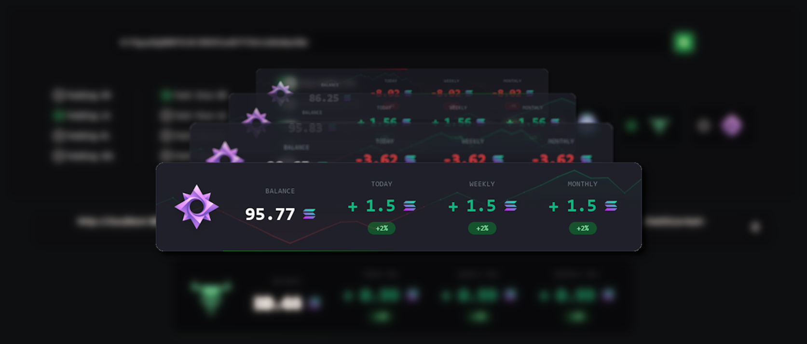

# SolTrack

**SolTrack** is a lightweight, real-time web application built with Next.js for tracking Solana wallet balances and calculating daily, weekly, and monthly profit and loss (PnL) statistics.

---



---

## Features

- **Real-Time Balance Tracking**: Displays the current balance of any Solana wallet.
- **PnL Calculations**:
  - Daily PnL
  - Weekly PnL
  - Monthly PnL
- **Automatic Refresh**: The dashboard automatically refreshes every 5 seconds.

---

## Prerequisites

To run this project, ensure you have the following installed:

- **Node.js 16+**
- **npm** (Node package manager)

---

## Installation

1. **Clone the Repository**:

   ```bash
   git clone https://github.com/maseurodrigo/SolTrack.git
   cd SolTrack
   ```

2. **Install Dependencies**:

   ```bash
   npm install
   ```

3. **Run the Application**:

   ```bash
   npm run start
   ```

4. **Access the Dashboard**:
   Open your browser and navigate to `http://localhost:8080`.

---

## Usage

### Querying a Wallet Address

To track a wallet, enter the wallet address in the input field on the dashboard and click "Track Wallet"

### Optional Features

- **Weekly PnL**: Enable the "Show Weekly PnL" toggle to display weekly profit and loss.
- **Monthly PnL**: Enable the "Show Monthly PnL" toggle to display monthly profit and loss.

---

## Configuration

- **RPC URL**: The Solana RPC endpoint is set to the mainnet by default.
- **Refresh Interval**: The default data refresh interval is 5 seconds.

---

## License

This project is licensed under the **MIT License**. See the [LICENSE](LICENSE) file for details.